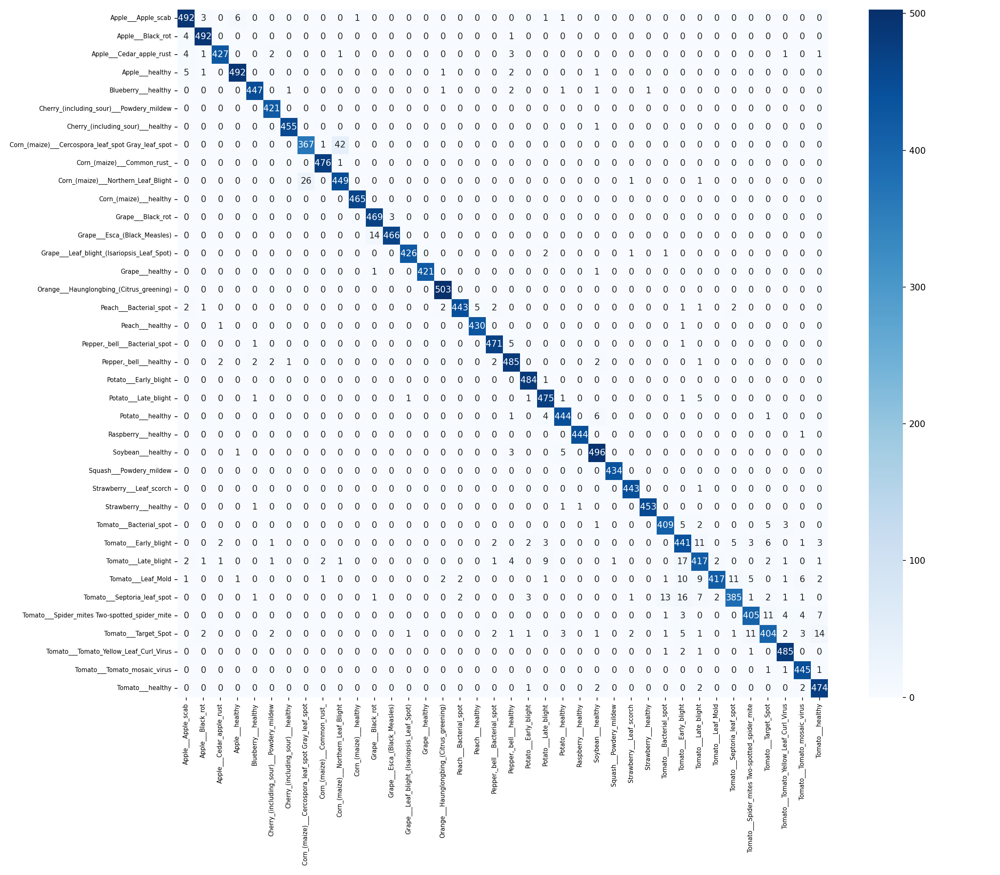

# 🌿 Plant Disease Classifier

A deep learning model that detects plant diseases from leaf images with **97% accuracy**.

## 🚀 Demo
Upload a plant leaf image and the model will predict the disease (or healthy status) with confidence scores.

## 🧠 Model
- **Architecture:** EfficientNet-B0 (Transfer Learning)
- **Dataset:** [New Plant Diseases Dataset](https://www.kaggle.com/datasets/vipoooool/new-plant-diseases-dataset)
- **Classes:** 38 (26 diseases + 12 healthy)
- **Training images:** 70,295
- **Validation accuracy:** 97%

## 🛠️ Tech Stack
- Python 3.13
- PyTorch + TorchVision
- Gradio (web interface)
- scikit-learn (evaluation metrics)

## 📊 Results

| Metric | Score |
|--------|-------|
| Accuracy | 97% |
| Macro F1 | 0.97 |
| Weighted F1 | 0.97 |



## ⚙️ Installation
```bash
git clone https://github.com/H-Ipek/plant-disease-classifier.git
cd plant-disease-classifier
pip install -r requirements.txt
```

## 🖥️ Usage
```bash
python app.py
```

Then open `http://127.0.0.1:7860` in your browser.

## 📁 Project Structure
```
plant-disease-classifier/
├── model.py        # EfficientNet-B0 model definition
├── train.py        # Training pipeline
├── app.py          # Gradio web interface
├── outputs/        # Confusion matrix and plots
└── requirements.txt
```
```